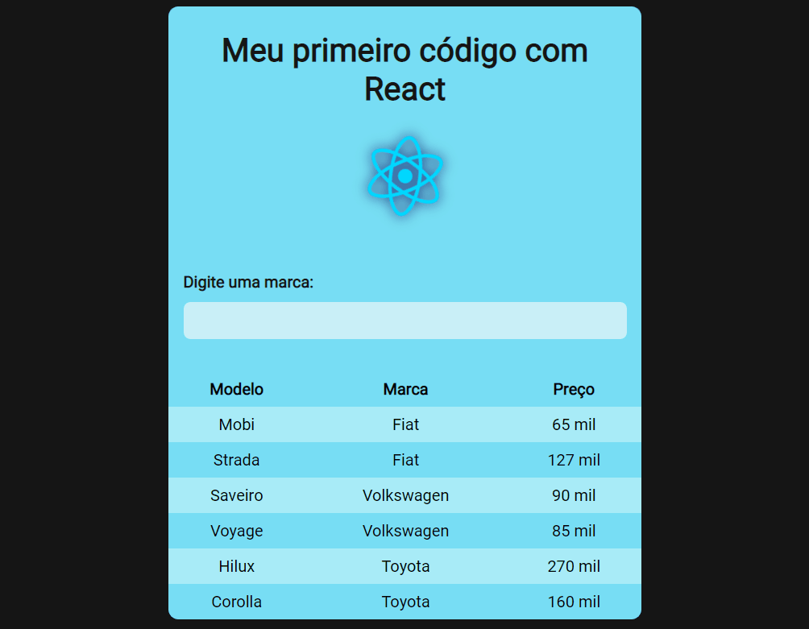

<h1 align="center">Tabela de carros</h1>
<h4 align="center">Tabela para fazer a busca de uma marca de carro</h4>
<h4 align="center">Feito com React.js</h4>

 &#xa0;

**
Sumário
**

<a href="#dart-sobre">Sobre</a> &#xa0; | &#xa0;
<a href="#books-O-que-eu-aprendi">O que aprendi</a> &#xa0; | &#xa0;
<a href="#white_check_mark-funcionalidades">Funcionalidades</a> &#xa0; | &#xa0;
<a href="#computer-tecnologias">Tecnologias</a> &#xa0; | &#xa0;
<a href="#hammer_and_wrench-serviços">Serviços</a>

<a href="#camera-imagens">Imagens</a> &#xa0; | &#xa0;
<a href="#orange_book-como-usar">Como usar</a> &#xa0; | &#xa0;
<a href="#scroll-pré-requisitos">Pré-requisitos</a> &#xa0; | &#xa0;
<a href="#link-links">Links</a> &#xa0; | &#xa0;
<a href="#sparkles-autor">Autor</a>

 &#xa0;
 
## :dart: Sobre

O principal objetivo do projeto foi desenvolver minha primeira aplicação utilizando a biblioteca React.js.

Consiste em uma tabela que contém algumas informações de alguns carros, e possibilita o usuário fazer uma busca de determinada marca.

&#xa0;

## :books: O que eu aprendi?

📌 Componentização React;

📌 Renderização da página com React;

📌 React Hooks - useState;

📌 Utilização das funções filter e map para filtrar elementos no React;

📌 Desenvolver projetos com Vite.

&#xa0;

## :white_check_mark: Funcionalidades
As principais funcionalidades do projeto são:

✔️ Exibir ao usuário uma tabela com as informações dos carros;

✔️ Permitir o usuário realizar uma busca dos carros de determinada marca;

&#xa0;

## :computer: Tecnologias
* [HTML](https://developer.mozilla.org/pt-BR/docs/Web/HTML)

* [CSS](https://developer.mozilla.org/pt-BR/docs/Web/CSS)

* [React.js](https://pt-br.reactjs.org/)

* [Vite](https://vitejs.dev/)

&#xa0;

## :hammer_and_wrench: Serviços
* <a href="https://github.com/">GitHub</a>

* <a href="https://www.netlify.com/">Netlify </a>- hospedagem

* <a href="https://fonts.google.com/">Google Fonts </a>- importação da fonte

&#xa0;

## :camera: Imagens
**
Exemplo de funcionamento:
**

  

&#xa0;

## :orange_book: Como usar

Acesse a aplicação pelo link.

Será exibido uma tabela que contém alguns carros e suas informações.

Você pode realizar uma busca dos veículos de determinada marca através da barra de pesquisa.

&#xa0;

## :scroll: Pré requisitos
Para utilizar o sistema, basta um navegador de sua preferência e conexão com internet.

&#xa0;

## :link: Links
* Repositório: https://github.com/CaioAugustoHD/Tabela-carros
* Deploy: https://tabeladecarros.netlify.app/

&#xa0;

## :sparkles: Autor

<h4>Feito por Caio Augusto Pereira</h4>

&#xa0;

 

